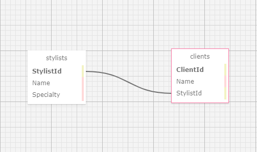

# Eau Claire's Salon: Employee Client Management Portal

#### A C# application built with ASP.NET Core & Entity to integrate MySQL databases

#### By Alex Adamovic

## Technologies Used

* _C#_
* _HTML_
* _CSS_
* _MySQL_

### Dependencies

* _Entity_
* _Bootstrap_
* _ASP.NET Core_

## Description

_This C# web application, styled as an employee / client management portal for Eau Claire's Salon, lets a user create a list of stylists, each with a roster of clients, that utilizes a MySQL database and connects the ```stylist``` and ```client``` tables in a One-To-Many relationship (see infographic below). From the splash page, the user is able to navigate between views to add stylists (with ```Name``` and ```Specialty``` properties) and clients (with ```Name``` and ```StylistId``` properties). By employing Entity and LINQ syntax, user form inputs are passed to the respective mySQL database tables through Post requests, and RESTful routes are employed with CRUD actions to ensure development standardization. HTML helper methods are also employed to DRY the code as much as possible. This application is meant to showcase proper database fundamentals in connecting an ASP.NET core web framework with mySQL databases using Entity._

### Database Table Structure



## Setup/Installation Requirements

#### To Install MySQL & MySQL Workbench

* _go to https://dev.mysql.com/downloads/ and install **MySQL Community Server** and **MySQL Workbench** for your operating system_
* _follow the instructions at [learnhowtoprogram](https://www.learnhowtoprogram.com/c-and-net/getting-started-with-c/installing-and-configuring-mysql) for proper installation_

#### To Set Up Project With Dependencies

* _clone repository from https://github.com/alexadamovic/HairSalon.Solution_
* _navigate to the project directory in your terminal/command line_
* _navigate to the subdirectory HairSalon and enter ```dotnet restore``` to install project dependencies_

#### To Import Database

* _open MySql Workbench_
* _in the Navigator > Administration window, select Data Import/Restore_
* _in Import Options select Import from Self-Contained File_
* _navigate to the file ```alex_adamovic.sql``` in the root directory of this project_
* _under Default Schema to be Imported To, select the New button_
* _enter the desired name of your database (you will need this name to set up your appsettings.json file properly)_
* _click Ok_
* _navigate to the tab called Import Progress and click Start Import at the bottom right corner of the window_
* _your database is now ready to incorporate into this project_

#### To Create appsettings.json

* _navigate to the subdirectory HairSalon and create the file ```appsettings.json```_
* _add the following code:_
```
{
  "ConnectionStrings": {
      "DefaultConnection": "Server=localhost;Port=3306;database=[YOUR_DATABASE];uid=[YOUR_USER_ID];pwd=[YOUR_PASSWORD];"
  }
}
```
* _replace the applicable sections with your database name, your user ID, and your password_
* _you are now ready to run the application_

#### To Run the Web Application

* _navigate to the subdirectory HairSalon and enter ```dotnet run``` for a snapshot server or ```dotnet watch run``` for a live updating server for the application_
* _access the server in your browser by entering ```localhost:5000``` into your navigation bar_
* _click the hyperlinks and submit forms to navigate between the views_
* _enter ```ctrl``` + ```c``` for Windows or ```command``` + ```.``` for Mac in your terminal/command line to stop the server_

## Known Bugs

* _user can still manually navigate to create client view in their browser to create a Client object before creating a Stylist object_
* _because the value will be set to "null", client will only be available via search and not in the stylist list pages_

## License

_MIT License_

Copyright (c) _2022_ _Alex Adamovic_

## Contact Information

alexanderadamovic@gmail.com